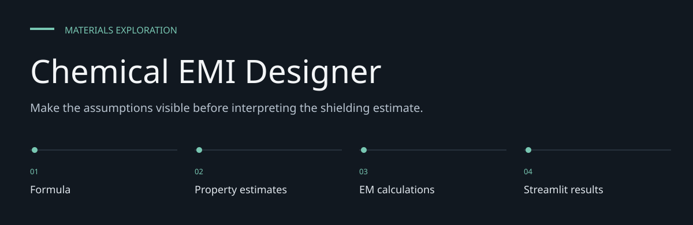
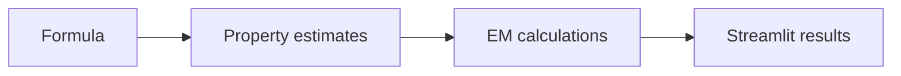

# Chemical EMI Designer

**Make the assumptions visible before interpreting the shielding estimate.**

A Streamlit exploration tool for constructing chemical formulas and estimating electromagnetic
shielding from material-property assumptions, frequency and thickness.


[Architecture](docs/ARCHITECTURE.md) · [Evaluation guide](docs/EVALUATION.md)

**Contents:** [The challenge](#the-challenge) · [Walkthrough](#walk-through-the-project) ·
[Implementation](#implementation-state) · [Design choices](#engineering-choices) ·
[Next evidence](#next-evidence-to-collect)

---

## The challenge

Material-selection discussions often jump from a chemical formula to a shielding claim. This tool
exposes an intermediate computational path: formula/property assumptions, frequency and thickness
lead to calculated electromagnetic terms that can be inspected separately.

## System at a glance



## Walk through the project

### 1. Compose the input

Choose elements and quantities or a molecular preset. Inspect the material-property assumptions
used for the assembled formula.

### 2. Set the physical conditions

Frequency, thickness, conductivity, permeability and permittivity determine the modeled response.
Units and material provenance are part of the input, not cosmetic labels.

### 3. Calculate shielding terms

The physics module calculates impedance, propagation, skin depth and shielding components. Read
each term before interpreting total shielding.

### 4. Compare and challenge

Use frequency or thickness exploration to see how the model changes. Compare against measured
material properties and laboratory data before drawing an engineering conclusion.

## Workflow

1. Select elements and quantities or choose a molecular preset.
2. Combine formulas into a proposed material mixture.
3. Calculate material properties and shielding components.
4. Inspect reflection, absorption, multiple-reflection and total shielding outputs.

The calculations are a model of supplied properties. Building a formula in the UI does not
establish that a chemical reaction occurs or that a synthesized material has those properties.

## Run locally

```bash
git clone https://github.com/DanushArun/material-emi-shielding.git
cd material-emi-shielding
python3 -m venv .venv
source .venv/bin/activate
python -m pip install -r requirements.txt
streamlit run streamlit_app/app.py
```

Open the URL printed by Streamlit, normally `http://localhost:8501`.

## Computational structure

| Source | Responsibility |
| --- | --- |
| [app.py](streamlit_app/app.py) | Formula builder and results interface |
| [molecular_presets.py](streamlit_app/molecular_presets.py) | Molecule/reaction presets |
| [material_properties.py](src/materials/material_properties.py) | Formula/property handling |
| [emi_calculations.py](src/physics/emi_calculations.py) | Shielding and frequency calculations |
| [constants.py](src/utils/constants.py) | Constants and input validation |

The physics module computes skin depth and complex impedance/propagation, combines shielding
terms, and includes frequency sweeps and a thickness search. The multiple-reflection correction
is suppressed when modeled absorption exceeds 15 dB.

## Evidence and limits

Tracked source and dependency/setup paths were reviewed. No laboratory shielding measurement,
material synthesis, numerical benchmark or UI acceptance run was performed for this README.
There is no committed automated test suite.

Weighted material-property estimates and simplified electromagnetic assumptions need independent
validation for the material, frequency range and geometry of interest. Displayed ratings are
software outputs, not a material certification or experimental shielding result.

## Engineering choices

**Separate property and physics layers.** Formula handling does not hide the physical inputs to
shielding calculations.

**Expose shielding components.** Reflection, absorption and multiple-reflection terms can be
inspected independently.

**Explicit model limits.** A weighted property estimate cannot replace measured behavior of a
synthesized material.

## Implementation state

| State | Current evidence |
| --- | --- |
| Present | Formula builder and molecular presets |
| Present | EM equations, sweeps and thickness search |
| Not supplied | Experimental shielding benchmark |
| Not established | Reaction feasibility or material certification |

The [architecture guide](docs/ARCHITECTURE.md) maps these statements to source entry points.
The [evaluation guide](docs/EVALUATION.md) separates inspection, executable checks and
domain validation, with the next evidence needed for each project.

## Next evidence to collect

- Add measured material-property provenance.
- Benchmark equations against independent reference cases.
- Validate numerical limits and experimentally measured shielding.
