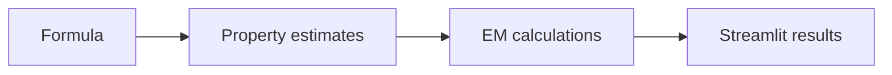

# Chemical EMI Designer — Architecture and implementation

This guide follows the tracked implementation. Proposed work is identified separately.

## The problem and the system boundary

Material-selection discussions often jump from a chemical formula to a shielding claim. This tool
exposes an intermediate computational path: formula/property assumptions, frequency and thickness
lead to calculated electromagnetic terms that can be inspected separately.

## Processing path

## End-to-end behavior

### 1. Compose the input

Choose elements and quantities or a molecular preset. Inspect the material-property assumptions
used for the assembled formula.

### 2. Set the physical conditions

Frequency, thickness, conductivity, permeability and permittivity determine the modeled response.
Units and material provenance are part of the input, not cosmetic labels.

### 3. Calculate shielding terms

The physics module calculates impedance, propagation, skin depth and shielding components. Read
each term before interpreting total shielding.

### 4. Compare and challenge

Use frequency or thickness exploration to see how the model changes. Compare against measured
material properties and laboratory data before drawing an engineering conclusion.

## Design choices and consequences

### Separate property and physics layers

Formula handling does not hide the physical inputs to shielding calculations.

### Expose shielding components

Reflection, absorption and multiple-reflection terms can be inspected independently.

### Explicit model limits

A weighted property estimate cannot replace measured behavior of a synthesized material.

## Source entry points

### [streamlit_app/app.py](../streamlit_app/app.py)

- `ChemicalParser` — Parse and validate chemical formulas and reactions.
- `ReactionEngine` — Handle chemical reactions and composition calculations.
- `get_element_category` — Get the periodic table category for styling.
- `format_number` — Format number with appropriate precision.
- `parse_formula` — Parse a chemical formula into element counts.
- `format_formula` — Format element composition back to chemical formula.

### [streamlit_app/molecular_presets.py](../streamlit_app/molecular_presets.py)

### [src/materials/material_properties.py](../src/materials/material_properties.py)

- `MaterialDatabase` — Manages the periodic table and material properties database.
- `__init__` — Initialize the material database.
- `_load_periodic_table` — Load the periodic table data from JSON file.
- `_load_alloys` — Load common alloys and their properties.
- `get_element` — Get properties of an element by its symbol.
- `get_alloy` — Get properties of an alloy by its name.

### [src/physics/emi_calculations.py](../src/physics/emi_calculations.py)

- `EMICalculator` — Performs electromagnetic interference shielding calculations.
- `__init__` — Initialize the EMI calculator.
- `calculate_skin_depth` — Calculate the skin depth of electromagnetic waves in a material.
- `calculate_intrinsic_impedance` — Calculate the intrinsic impedance of a material.
- `calculate_propagation_constant` — Calculate the propagation constant.
- `calculate_reflection_loss` — Calculate reflection loss at the air-material interface.

### [src/utils/constants.py](../src/utils/constants.py)

- `hz_to_mhz` — Convert frequency from Hz to MHz.
- `hz_to_ghz` — Convert frequency from Hz to GHz.
- `mhz_to_hz` — Convert frequency from MHz to Hz.
- `ghz_to_hz` — Convert frequency from GHz to Hz.
- `db_to_linear` — Convert dB to linear scale.
- `linear_to_db` — Convert linear scale to dB.

## Implementation state

| State | Evidence boundary |
| --- | --- |
| Present | Formula builder and molecular presets |
| Present | EM equations, sweeps and thickness search |
| Not supplied | Experimental shielding benchmark |
| Not established | Reaction feasibility or material certification |

“Present” means tracked source or assets exist. It does not mean a production or domain
validation has passed. See [Evaluation](EVALUATION.md) for reproducible checks and limits.
